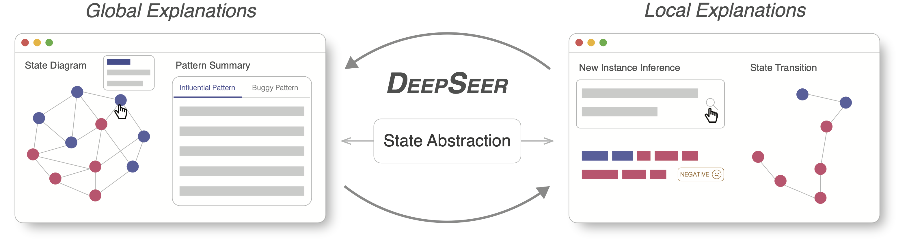

# DeepSeer: Interactive RNN Explanation and Debugging via State Abstraction



DeepSeer is an interactive system for developers to interpret and debug recurrent (stateful) neural networks. 
This repository contains the official implementation of our related paper:

**DeepSeer: Interactive RNN Explanation and Debugging via State Abstraction** 

*Zhijie Wang, Yuheng Huang, Da Song, Lei Ma, Tianyi Zhang*

2023 ACM CHI Conference on Human Factors in Computing Systems (CHI 2023)

## Getting Started

If you only want to try our tool with provided models, you can easily follow the instruction below to setup.
Note that, only necessary scrips about state abstraction techniques are included in the backend (`server/deepstellar_backend`).

If you want to use DeepSeer with your own model, please follow the folder `ml_dev` for more details.

### Environments Set-up

#### Python >= 3.6

*We suggest use virtual environment to avoid messing up your own environments.*

~~~sh
$ python -m venv ./venv
$ source ./venv/bin/activate
$ pip install -r ./server/deepstellar_backend/requirements.txt
~~~

#### NPM >= 7 

~~~sh
$ cd ./web/dashboard
$ npm install
~~~

### Basic Usage

#### Quick start

~~~sh
$ npm start
~~~
Copy the url and open it in browser.

#### Start backend

~~~sh
$ source ./venv/bin/activate
$ cd ./server/deepstellar_backend
$ python server.py
~~~

#### Switch between different models

The main branch was set to a binary classification RNN model trained on Toxic dataset. To switch, please checkout different branches (remember to restart backend).


## Citation

If you found our paper/code useful in your research, please consider citing:

```
@inproceedings{wang2023deepseer,
 author = {Wang, Zhijie and Huang, Yuheng and Song, Da and Ma, Lei and Zhang, Tianyi},
 title = {DeepSeer: Interactive RNN Explanation and Debugging via State Abstraction},
 booktitle = {Proceedings of the 2023 CHI Conference on Human Factors in Computing Systems},
 year = {2023},
} 
```

## License

This project is released under the [MIT license](https://github.com/momentum-lab-workspace/DeepSeer/blob/main/LICENSE.MD).

## Acknowledgement

Special thanks to our pilot study participants for helping us improve DeepSeer.
